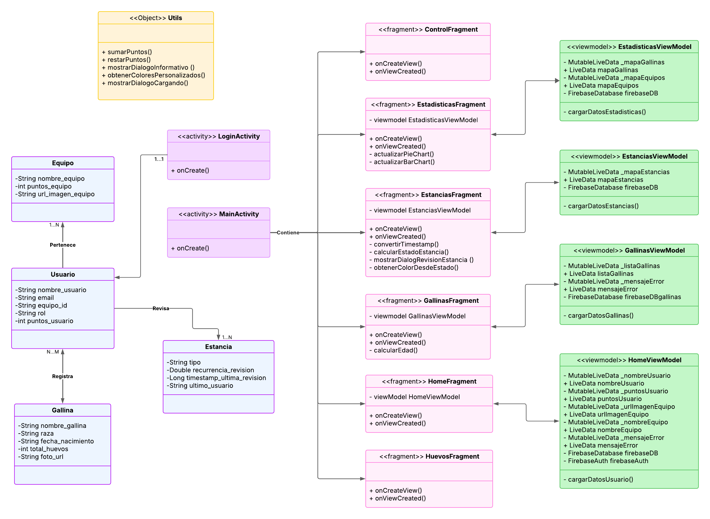

# 🐣 EggStat

**Proyecto final del CFGS de Desarrollo de Aplicaciones Multiplataforma**  
Autora: Celia Pérez Vargas

**EggStat** es una app desarrollada en **Android nativo (Kotlin)** como proyecto final de ciclo, cuyo objetivo es fomentar el cuidado de gallineros escolares mediante una experiencia educativa, gamificada e interactiva. Está pensada para ser utilizada por docentes y alumnos/as, registrando y motivando las tareas del gallinero en el entorno escolar.

El tiempo para desarrollar esta app fue de **2 meses**, por lo que de momento solo cumple funcionalidades básicas, mejorables si en un futuro tengo tiempo para dedicarle :)

---

## 📑 Índice

1. [🔧 Herramientas utilizadas](#-herramientas-utilizadas)
2. [📱 Proyecto](#-proyecto)
    - [📐 Arquitectura de la app](#arquitectura-de-la-app)
    - [🎥 Demo](#demo)
    - [📄 Manual de Usuario](#manual-de-usuario)
    - [⚙️ Instalación](#instalación)
    - [⚠️Importante](#importante)
3. [📄 Licencia](#-licencia)

---

## 🔧 Herramientas utilizadas

---

## 📱 Proyecto

### 📐 Arquitectura de la app

Conforme planeo la app me doy cuenta que necesitaré una arquitectura **_Model View ViewModel_**, para que los datos que se muestran en las vistas siempre estén actualizados. Dividiendo la app en dos activities (`MainActivity.kt` y `LoginActivity.kt`), serán los ViewModels los encargados de observar mediante `LiveData` los cambios de **Firebase**, y transmitirlos a las correspondientes views (Fragments).

En el siguiente **diagrama de clases** se puede visualizar la arquitectura de la app:

  

🔗 [Diagrama de Clases en Lucidchart](https://lucid.app/lucidchart/0e3be1a1-bf94-4d1b-92b1-bce4c2904e01/edit?invitationId=inv_44928207-5e74-4140-8bdf-5f277bd33dc3)

### 🎥 Demo

Para ver la demo de la app, hacer clic sobre la imagen:

  

### 📄 Manual de Usuario

Puedes consultar el manual completo aquí (te recomiendo que lo veas, ¡me quedó super cuqui!):  
[Manual de Usuario (PDF)](archivos_eggstat/Eggstat_manual-de-usuario.pdf)

⚠️ Hay dos manuales: primero el manual de profesor, y luego el manual de usuario (alumno).

### ⚙️ ️️Instalación

De momento, la app no está en la PlayStore de Google, por lo que actualmente hay que seguir los siguientes pasos para su instalación:

📲 Primero, **descarga la [apk de EggStat](EggStat.apk)**, e introdúcela en tu smartphone **Android**.

📄 Luego, sigue los pasos detallados en el siguiente documento:  
[Manual de Instalación (PDF)](archivos_eggstat/Eggstat_manual-de-instalacion.pdf)

### ⚠️ Importante

Si deseas clonar este repositorio y ejecutar la app localmente, ten en cuenta que:
- Necesitas crear un proyecto propio en **Firebase**.
- Será necesario configurar **Firebase Auth** y **Firebase Realtime Database**.
- Deberás añadir tu propio archivo `google-services.json` en la ruta `/app` para habilitar las funcionalidades de autenticación y base de datos.

---

## 📄 Licencia

Este proyecto está licenciado bajo la [Licencia MIT](LICENSE).